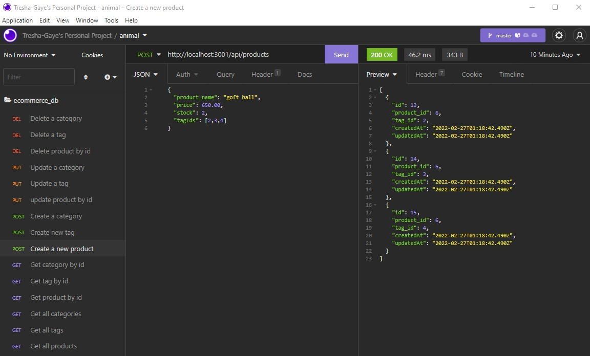
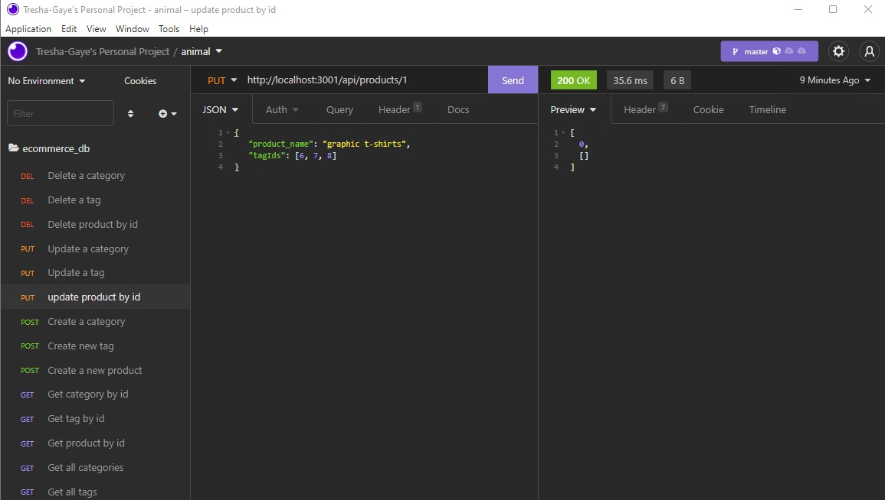

# E-commerce Back End 

## Description

This application is the back-end for an e-commerce site, e-shopper, that uses a working Express.js API and configures it to use Sequelize to interact with MySQL database.

You may view the the walkthru video that demonstrates the application's functionality by [clicking this link](https://drive.google.com/file/d/1JtXdQnx_GbzDKqfqK7n_W_6nA23d_uLi/view).

## Technologies
- MySQL2 and Sequelize packages used to connect to the database
- dotenv package used for environment variables to store sensitive data

## Criteria

***User Story**

AS A manager at an internet retail company
I WANT a back end for my e-commerce website that uses the latest technologies
SO THAT my company can compete with other e-commerce companies

**Acceptance Criteria**

GIVEN a functional Express.js API

WHEN I add my database name, MySQL username, and MySQL password to an environment variable file
THEN I am able to connect to a database using Sequelize

WHEN I enter schema and seed commands
THEN a development database is created and is seeded with test data

WHEN I enter the command to invoke the application
THEN my server is started and the Sequelize models are synced to the MySQL database

WHEN I open API GET routes in Insomnia for categories, products, or tags
THEN the data for each of these routes is displayed in a formatted JSON

WHEN I test API POST, PUT, and DELETE routes in Insomnia
THEN I am able to successfully create, update, and delete data in my database

**Accomplishment**
The application successfully connects to and seeds the database and the routes as tested in Insomnia are working as intended. 

**Below are a screenshots of the app showing the functionality:**

Below are images of Insomnia showing the saved GET/POST/PUT/DELETE API routes  
 
  
 
  

## Contributing

## Credits

**The following resources were used to complete this project:**
1. UCONN Coding Bootcamp's modules on ORM/Sequelize and Express.js
2. [MySQL2](https://www.npmjs.com/package/mysql2) Documentation 

## License

